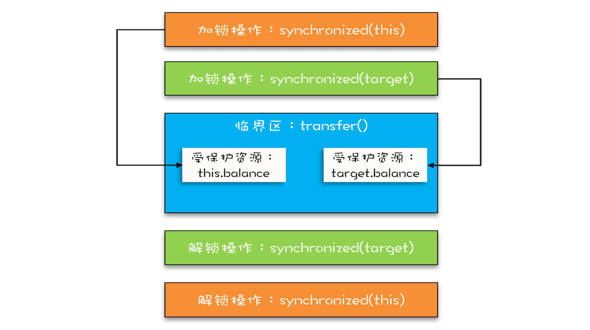

[toc]

## 05 | 一不小心就死锁了，怎么办？

-   上节中，我们用 Account.class 作为互斥锁，来解决银行转账问题，所有账户的转账都是串行的。如账户 A 转账户 B、账户 C 转账户 D，都被串行化了，性能太差了。

### 向现实世界要答案

-   现实世界里，账户转账操作是支持并发的，而且绝对是真正的并行。

-   在编程世界里，其实是用两把锁就实现了，转出账本一把，转入账本一把。我们首先尝试锁定转出账户 this，然后尝试锁定转入账户 target，只有当两者都成功时，才执行转账操作。模型图如下：“两个转账操作并行示意图”

    -   

-   代码实现，如下：

    -   ```java
        
        class Account {
          private int balance;
          // 转账
          void transfer(Account target, int amt){
            // 锁定转出账户
            synchronized(this) {              
              // 锁定转入账户
              synchronized(target) {           
                if (this.balance > amt) {
                  this.balance -= amt;
                  target.balance += amt;
                }
              }
            }
          } 
        }
        ```

    -   

### 没有免费的午餐

-   上面实现看上去很完美，我们锁定的范围小多了。这样的锁，我们上节叫：**细粒度锁，使用细粒度锁可以提高并行度，是性能优化的一个重要手段。**
-   **使用细粒度锁是有代价的，这个代价就是可能会导致死锁。**
    -   
-   死锁的一个比较专业的定义：**一组互相竞争资源的线程因互相等待，导致“永久”阻塞的现象。**
-   关于这种现象，我们还可以借助**资源分配图**来可视化锁的占用情况。
    -   

### 如何预防死锁

-   分析**死锁发生条件**： -- Coffman
    1.  互斥
    2.  占有且等待
    3.  不可抢占
    4.  循环等待
-   反过来分析，**也就是只要我们破坏其中一个，就可以成功避免死锁的发生。**