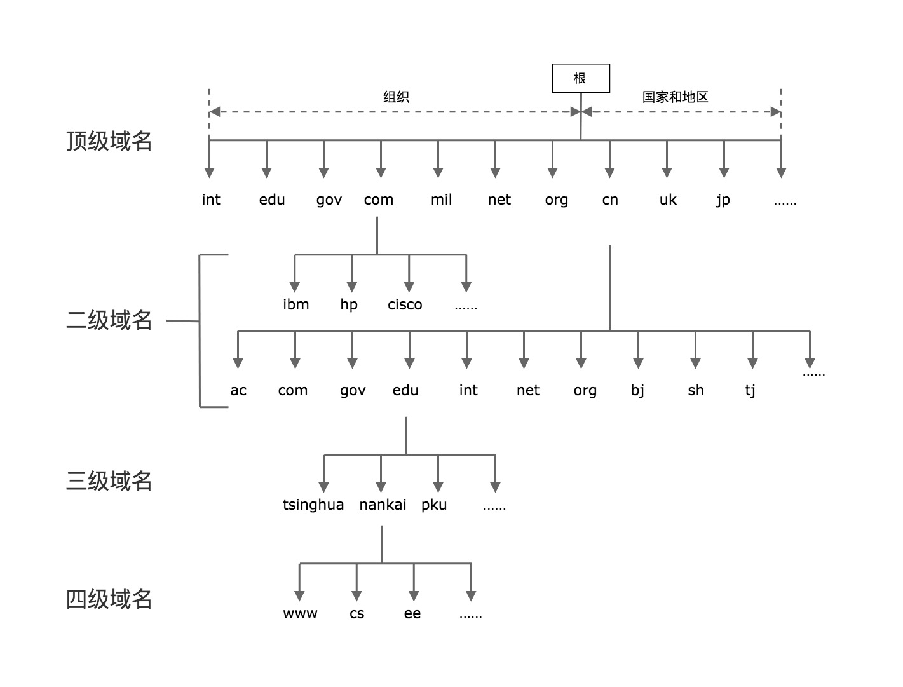

[toc]

## 02 | 网络编程模型：认识客户端-服务器网络模型的基本概念

### 客户端 - 服务器网络编程模型

-   网络请求过程
    -   

### IP 和端口

### 保留网段

### 子网掩码

### 全球域名系统

-   

### 数据报和字节流

-   TCP，又被叫做字节流套接字（Stream Socket）。
-   UDP，数据报套接字（Datagram Socket）。

### 总结

-   需要重点关注下：
    1.  网络编程需要牢牢立起“客户端”和“服务器”模型，两者编程的方法和框架是明显不同的。
    2.  TCP 连接是客户端 - 服务器的 IP 和端口四元组唯一确定的，IP 是一台机器在网络世界的唯一标识。
    3.  有两种截然不同的传输层协议，面向连接的“数据流“协议 TCP，以及无连接的“数据报”协议 UDP。

