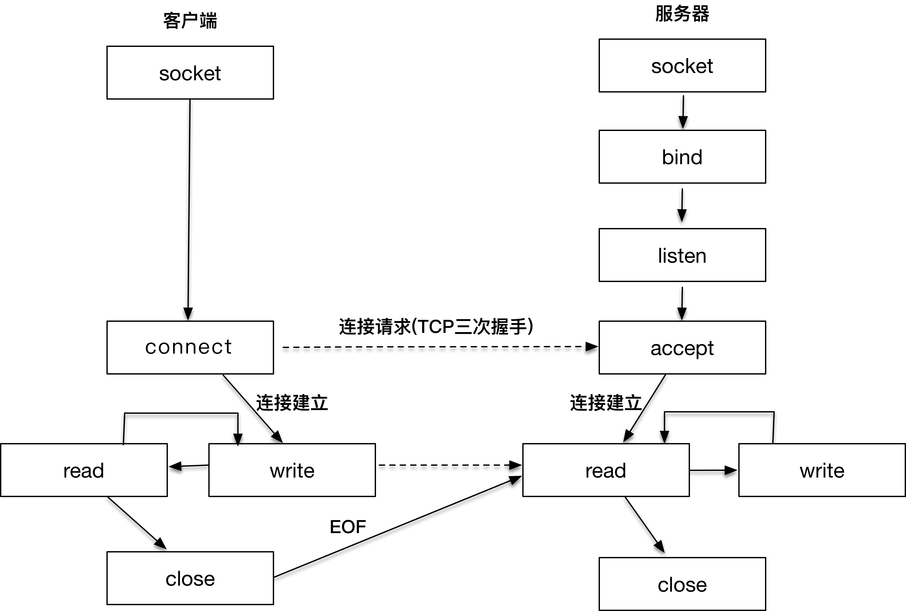

[toc]

## 03 | 套接字和地址：像电话和电话号码一样理解它们

### socket 到底是什么？

-   如下图，表达的是网络编程中，客户端和服务器工作的核心逻辑。

-   

-   三次握手完成，客户端和服务器端建立连接，就进入数据传输的过程。
-   具体来说，客户端进程向操作系统内核发起 write 字节流写操作，内核协议栈将字节流通过网络设备传输到服务器端，服务器端从内核得到信息，将字节流从内核读入到进程中，并开始业务逻辑处理，完成后，服务器端再将结果以同样的方式写给客户端。可以看到，**一旦连接建立，数据的传输就不再是单向的，而是双向的，这也是 TCP 的一个显著特性**。

### 更好理解 socket：一个更直观的解释

-   整个电话交流过程。

### socket 发展史

### 套接字地址格式

#### 通用套接字地址格式

-   套接字的**通用**地址结构：

    -   ```C
        
        /* POSIX.1g 规范规定了地址族为2字节的值.  */
        typedef unsigned short int sa_family_t;
        /* 描述通用套接字地址  */
        struct sockaddr{
            sa_family_t sa_family;  /* 地址族.  16-bit*/
            char sa_data[14];   /* 具体的地址值 112-bit */
          }; 
        ```

    -   第一个字段是地址族，表示使用什么样的方式对地址进行解释和保存。地址族在 glibc 里定义非常多，常用的有以下几种：

        -   AF_LOCAL
        -   AF_INET
        -   AF_INET6

    -   AF_ 表示 Address Family

    -   PF_ 表示 Protocal Family

-   我们在 <sys/socket.h> 头文件中可以看到，AF 和 PF 是一一对应的。

    -   ```C
        
        /* 各种地址族的宏定义  */
        #define AF_UNSPEC PF_UNSPEC
        #define AF_LOCAL  PF_LOCAL
        #define AF_UNIX   PF_UNIX
        #define AF_FILE   PF_FILE
        #define AF_INET   PF_INET
        #define AF_AX25   PF_AX25
        #define AF_IPX    PF_IPX
        #define AF_APPLETALK  PF_APPLETALK
        #define AF_NETROM PF_NETROM
        #define AF_BRIDGE PF_BRIDGE
        #define AF_ATMPVC PF_ATMPVC
        #define AF_X25    PF_X25
        #define AF_INET6  PF_INET6
        ```

    -   

#### IPv4 套接字格式地址

-   IPv4 地址族结构：

    -   ```C
        
        /* IPV4套接字地址，32bit值.  */
        typedef uint32_t in_addr_t;
        struct in_addr
          {
            in_addr_t s_addr;
          };
          
        /* 描述IPV4的套接字地址格式  */
        struct sockaddr_in
          {
            sa_family_t sin_family; /* 16-bit */
            in_port_t sin_port;     /* 端口口  16-bit*/
            struct in_addr sin_addr;    /* Internet address. 32-bit */
        
        
            /* 这里仅仅用作占位符，不做实际用处  */
            unsigned char sin_zero[8];
          };
        ```

-   glibc 定义的保留端口

    -   ```C
        
        /* Standard well-known ports.  */
        enum
          {
            IPPORT_ECHO = 7,    /* Echo service.  */
            IPPORT_DISCARD = 9,   /* Discard transmissions service.  */
            IPPORT_SYSTAT = 11,   /* System status service.  */
            IPPORT_DAYTIME = 13,  /* Time of day service.  */
            IPPORT_NETSTAT = 15,  /* Network status service.  */
            IPPORT_FTP = 21,    /* File Transfer Protocol.  */
            IPPORT_TELNET = 23,   /* Telnet protocol.  */
            IPPORT_SMTP = 25,   /* Simple Mail Transfer Protocol.  */
            IPPORT_TIMESERVER = 37, /* Timeserver service.  */
            IPPORT_NAMESERVER = 42, /* Domain Name Service.  */
            IPPORT_WHOIS = 43,    /* Internet Whois service.  */
            IPPORT_MTP = 57,
        
        
        
        
            IPPORT_TFTP = 69,   /* Trivial File Transfer Protocol.  */
            IPPORT_RJE = 77,
            IPPORT_FINGER = 79,   /* Finger service.  */
            IPPORT_TTYLINK = 87,
            IPPORT_SUPDUP = 95,   /* SUPDUP protocol.  */
        
        
            IPPORT_EXECSERVER = 512,  /* execd service.  */
            IPPORT_LOGINSERVER = 513, /* rlogind service.  */
            IPPORT_CMDSERVER = 514,
            IPPORT_EFSSERVER = 520,
        
        
            /* UDP ports.  */
            IPPORT_BIFFUDP = 512,
            IPPORT_WHOSERVER = 513,
            IPPORT_ROUTESERVER = 520,
        
        
            /* Ports less than this value are reserved for privileged processes.  */
            IPPORT_RESERVED = 1024,
        
        
            /* Ports greater this value are reserved for (non-privileged) servers.  */
            IPPORT_USERRESERVED = 5000
        ```

    -   

#### IPv6 套接字地址格式

-   IPv6 的地址结构：

    -   ```C
        
        struct sockaddr_in6
          {
            sa_family_t sin6_family; /* 16-bit */
            in_port_t sin6_port;  /* 传输端口号 # 16-bit */
            uint32_t sin6_flowinfo; /* IPv6流控信息 32-bit*/
            struct in6_addr sin6_addr;  /* IPv6地址128-bit */
            uint32_t sin6_scope_id; /* IPv6域ID 32-bit */
          };
        ```

#### 本地套接字格式

-   用来本地进程间的通信，也就是前面提到的 AF_LOCAL

    -   ```C
        
        struct sockaddr_un {
            unsigned short sun_family; /* 固定为 AF_LOCAL */
            char sun_path[108];   /* 路径名 */
        };
        ```

### 几种套接字地址格式比较

-   