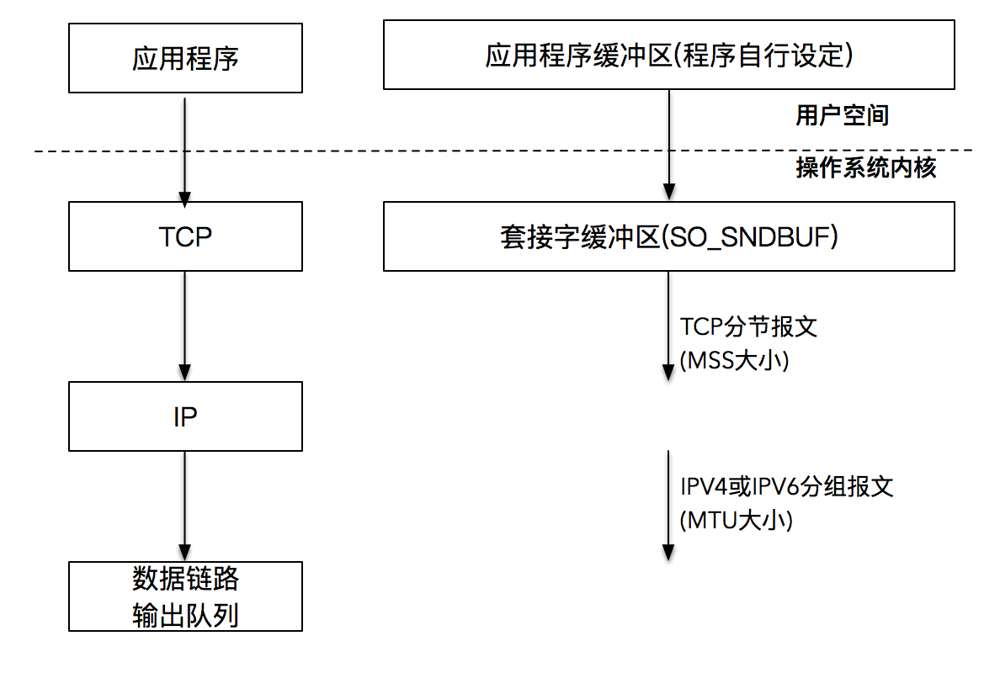

[toc]

## 05 | 使用套接字进行读写：开始交流吧

### 发送数据

-   发送数据时常用的三个函数：

    -   ```C
        
        ssize_t write (int socketfd, const void *buffer, size_t size)
        ssize_t send (int socketfd, const void *buffer, size_t size, int flags)
        ssize_t sendmsg(int sockfd, const struct msghdr *msg, int flags)
        ```

    -   

### 发送缓冲区

-   应用程序调用 write 函数时，
-   


### 读取数据

#### read 函数

-   read 函数原型：

    -   ```C
        
        ssize_t read (int socketfd, void *buffer, size_t size)
        ```

    -   

### 缓冲区实验

#### 服务器端读取数据程序

-   ```C
    
    #include "lib/common.h"
    
    void read_data(int sockfd) {
        ssize_t n;
        char buf[1024];
    
        int time = 0;
        for (;;) {
            fprintf(stdout, "block in read\n");
            if ((n = readn(sockfd, buf, 1024)) == 0)
                return;
    
            time++;
            fprintf(stdout, "1K read for %d \n", time);
            usleep(1000);
        }
    }
    
    
    int main(int argc, char **argv) {
        int listenfd, connfd;
        socklen_t clilen;
        struct sockaddr_in cliaddr, servaddr;
    
        listenfd = socket(AF_INET, SOCK_STREAM, 0);
    
        bzero(&servaddr, sizeof(servaddr));
        servaddr.sin_family = AF_INET;
        servaddr.sin_addr.s_addr = htonl(INADDR_ANY);
        servaddr.sin_port = htons(12345);
    
        /* bind到本地地址，端口为12345 */
        bind(listenfd, (struct sockaddr *) &servaddr, sizeof(servaddr));
        /* listen的backlog为1024 */
        listen(listenfd, 1024);
    
        /* 循环处理用户请求 */
        for (;;) {
            clilen = sizeof(cliaddr);
            connfd = accept(listenfd, (struct sockaddr *) &cliaddr, &clilen);
            read_data(connfd);   /* 读取数据 */
            close(connfd);          /* 关闭连接套接字，注意不是监听套接字*/
        }
    }
    ```


#### 客户端发送数据程序

-   ```C
    
    #include "lib/common.h"
    
    #define MESSAGE_SIZE 102400
    
    void send_data(int sockfd) {
        char *query;
        query = malloc(MESSAGE_SIZE + 1);
        for (int i = 0; i < MESSAGE_SIZE; i++) {
            query[i] = 'a';
        }
        query[MESSAGE_SIZE] = '\0';
    
        const char *cp;
        cp = query;
        size_t remaining = strlen(query);
        while (remaining) {
            int n_written = send(sockfd, cp, remaining, 0);
            fprintf(stdout, "send into buffer %ld \n", n_written);
            if (n_written <= 0) {
                error(1, errno, "send failed");
                return;
            }
            remaining -= n_written;
            cp += n_written;
        }
    
        return;
    }
    
    int main(int argc, char **argv) {
        int sockfd;
        struct sockaddr_in servaddr;
    
        if (argc != 2)
            error(1, 0, "usage: tcpclient <IPaddress>");
    
        sockfd = socket(AF_INET, SOCK_STREAM, 0);
    
        bzero(&servaddr, sizeof(servaddr));
        servaddr.sin_family = AF_INET;
        servaddr.sin_port = htons(12345);
        inet_pton(AF_INET, argv[1], &servaddr.sin_addr);
        int connect_rt = connect(sockfd, (struct sockaddr *) &servaddr, sizeof(servaddr));
        if (connect_rt < 0) {
            error(1, errno, "connect failed ");
        }
        send_data(sockfd);
        exit(0);
    }
    ```

#### 实验一：观察客户端数据发送行为

-   


#### 实验二：服务端处理变慢

-   客户端
    -   

### 总结

-   对于 send 来说，返回成功仅仅表示数据写到发送缓冲区成功，并不表示对端已经成功收到。
-   对于 read 来说，需要循环读取数据，并且需要考虑 EOF 等异常条件。