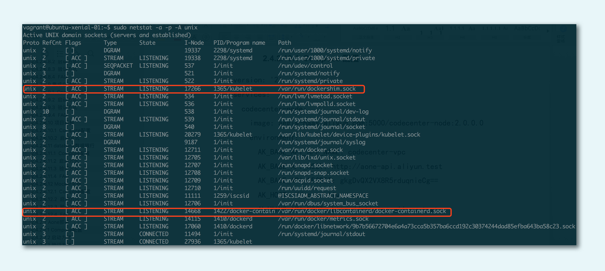

[toc]

## 07 | 本地套接字

### 从例子开始

-   kubelet 基于本地套字的客户端 - 服务器
    -   
-   docker 使用本地套接字描述符：
    -   

### 本地套接字概述

-   本地套接字（UNIX 域套接字），是一种特殊类型的套接字，和 TCP/UDP 套接字不同。本地套接字，严格意义上说提供了一种单主机跨进程间调用的手段，减少了协议栈实现的复杂度，效率比 TCP/UDP 套接字都要高许多。

-   本地地址：

    -   

    

### 本地字节流套接字

-   服务端例子：

    -   ```C
        
        #include  "lib/common.h"
        
        int main(int argc, char **argv) {
            if (argc != 2) {
                error(1, 0, "usage: unixstreamserver <local_path>");
            }
        
            int listenfd, connfd;
            socklen_t clilen;
            struct sockaddr_un cliaddr, servaddr;
        
            listenfd = socket(AF_LOCAL, SOCK_STREAM, 0);
            if (listenfd < 0) {
                error(1, errno, "socket create failed");
            }
        
            char *local_path = argv[1];
            unlink(local_path);
            bzero(&servaddr, sizeof(servaddr));
            servaddr.sun_family = AF_LOCAL;
            strcpy(servaddr.sun_path, local_path);
        
            if (bind(listenfd, (struct sockaddr *) &servaddr, sizeof(servaddr)) < 0) {
                error(1, errno, "bind failed");
            }
        
            if (listen(listenfd, LISTENQ) < 0) {
                error(1, errno, "listen failed");
            }
        
            clilen = sizeof(cliaddr);
            if ((connfd = accept(listenfd, (struct sockaddr *) &cliaddr, &clilen)) < 0) {
                if (errno == EINTR)
                    error(1, errno, "accept failed");        /* back to for() */
                else
                    error(1, errno, "accept failed");
            }
        
            char buf[BUFFER_SIZE];
        
            while (1) {
                bzero(buf, sizeof(buf));
                if (read(connfd, buf, BUFFER_SIZE) == 0) {
                    printf("client quit");
                    break;
                }
                printf("Receive: %s", buf);
        
                char send_line[MAXLINE];
                sprintf(send_line, "Hi, %s", buf);
        
                int nbytes = sizeof(send_line);
        
                if (write(connfd, send_line, nbytes) != nbytes)
                    error(1, errno, "write error");
            }
        
            close(listenfd);
            close(connfd);
        
            exit(0);
        
        }
        ```

    -   **这里创建的套接字类型，注意是 AF_LOCAL，并且使用字节流格式**。

-   客户端程序

    -   ```C
        
        #include "lib/common.h"
        
        int main(int argc, char **argv) {
            if (argc != 2) {
                error(1, 0, "usage: unixstreamclient <local_path>");
            }
        
            int sockfd;
            struct sockaddr_un servaddr;
        
            sockfd = socket(AF_LOCAL, SOCK_STREAM, 0);
            if (sockfd < 0) {
                error(1, errno, "create socket failed");
            }
        
            bzero(&servaddr, sizeof(servaddr));
            servaddr.sun_family = AF_LOCAL;
            strcpy(servaddr.sun_path, argv[1]);
        
            if (connect(sockfd, (struct sockaddr *) &servaddr, sizeof(servaddr)) < 0) {
                error(1, errno, "connect failed");
            }
        
            char send_line[MAXLINE];
            bzero(send_line, MAXLINE);
            char recv_line[MAXLINE];
        
            while (fgets(send_line, MAXLINE, stdin) != NULL) {
        
                int nbytes = sizeof(send_line);
                if (write(sockfd, send_line, nbytes) != nbytes)
                    error(1, errno, "write error");
        
                if (read(sockfd, recv_line, MAXLINE) == 0)
                    error(1, errno, "server terminated prematurely");
        
                fputs(recv_line, stdout);
            }
        
            exit(0);
        }
        ```

    -   

### 只启客户端

-   ```C
    
    $ ./unixstreamclient /tmp/unixstream.sock
    connect failed: No such file or directory (2)
    ```

-   

### 服务器端监听在无权限的文件路径上

-   ```java
    
    $ ./unixstreamserver /var/lib/unixstream.sock
    bind failed: Permission denied (13)
    ```

-   root 用户启动

-   ```C
    
    sudo ./unixstreamserver /var/lib/unixstream.sock
    (阻塞运行中)
    ```

-   使用 netstat 查看 UNIX 域套接字

-   

-   

### 服务器 - 客户端应答

-   ```C
    
    $./unixstreamserver /tmp/unixstream.sock
    Receive: g1
    Receive: g2
    Receive: g3
    client quit
    ```

-   ```C
    
    $./unixstreamclient /tmp/unixstream.sock
    g1
    Hi, g1
    g2
    Hi, g2
    g3
    Hi, g3
    ^C
    ```

-   

### 本地数据报套接字

-   服务端例子

-   ```C
    
    #include  "lib/common.h"
    
    int main(int argc, char **argv) {
        if (argc != 2) {
            error(1, 0, "usage: unixdataserver <local_path>");
        }
    
        int socket_fd;
        socket_fd = socket(AF_LOCAL, SOCK_DGRAM, 0);
        if (socket_fd < 0) {
            error(1, errno, "socket create failed");
        }
    
        struct sockaddr_un servaddr;
        char *local_path = argv[1];
        unlink(local_path);
        bzero(&servaddr, sizeof(servaddr));
        servaddr.sun_family = AF_LOCAL;
        strcpy(servaddr.sun_path, local_path);
    
        if (bind(socket_fd, (struct sockaddr *) &servaddr, sizeof(servaddr)) < 0) {
            error(1, errno, "bind failed");
        }
    
        char buf[BUFFER_SIZE];
        struct sockaddr_un client_addr;
        socklen_t client_len = sizeof(client_addr);
        while (1) {
            bzero(buf, sizeof(buf));
            if (recvfrom(socket_fd, buf, BUFFER_SIZE, 0, (struct sockadd *) &client_addr, &client_len) == 0) {
                printf("client quit");
                break;
            }
            printf("Receive: %s \n", buf);
    
            char send_line[MAXLINE];
            bzero(send_line, MAXLINE);
            sprintf(send_line, "Hi, %s", buf);
    
            size_t nbytes = strlen(send_line);
            printf("now sending: %s \n", send_line);
    
            if (sendto(socket_fd, send_line, nbytes, 0, (struct sockadd *) &client_addr, client_len) != nbytes)
                error(1, errno, "sendto error");
        }
    
        close(socket_fd);
    
        exit(0);
    }
    ```

-   **这里创建的套接字类型，注意是 AF_LOCAL，协议类型为 SOCK_DGRAM**。

-   客户端例子：

    -   ```C
        
        #include "lib/common.h"
        
        int main(int argc, char **argv) {
            if (argc != 2) {
                error(1, 0, "usage: unixdataclient <local_path>");
            }
        
            int sockfd;
            struct sockaddr_un client_addr, server_addr;
        
            sockfd = socket(AF_LOCAL, SOCK_DGRAM, 0);
            if (sockfd < 0) {
                error(1, errno, "create socket failed");
            }
        
            bzero(&client_addr, sizeof(client_addr));        /* bind an address for us */
            client_addr.sun_family = AF_LOCAL;
            strcpy(client_addr.sun_path, tmpnam(NULL));
        
            if (bind(sockfd, (struct sockaddr *) &client_addr, sizeof(client_addr)) < 0) {
                error(1, errno, "bind failed");
            }
        
            bzero(&server_addr, sizeof(server_addr));
            server_addr.sun_family = AF_LOCAL;
            strcpy(server_addr.sun_path, argv[1]);
        
            char send_line[MAXLINE];
            bzero(send_line, MAXLINE);
            char recv_line[MAXLINE];
        
            while (fgets(send_line, MAXLINE, stdin) != NULL) {
                int i = strlen(send_line);
                if (send_line[i - 1] == '\n') {
                    send_line[i - 1] = 0;
                }
                size_t nbytes = strlen(send_line);
                printf("now sending %s \n", send_line);
        
                if (sendto(sockfd, send_line, nbytes, 0, (struct sockaddr *) &server_addr, sizeof(server_addr)) != nbytes)
                    error(1, errno, "sendto error");
        
                int n = recvfrom(sockfd, recv_line, MAXLINE, 0, NULL, NULL);
                recv_line[n] = 0;
        
                fputs(recv_line, stdout);
                fputs("\n", stdout);
            }
        
            exit(0);
        }
        ```

-   服务端 - 客户端应答场景

    -   ```C
        
         ./unixdataserver /tmp/unixdata.sock
        Receive: g1
        now sending: Hi, g1
        Receive: g2
        now sending: Hi, g2
        Receive: g3
        now sending: Hi, g3
        ```

    -   ```C
        
        $ ./unixdataclient /tmp/unixdata.sock
        g1
        now sending g1
        Hi, g1
        g2
        now sending g2
        Hi, g2
        g3
        now sending g3
        Hi, g3
        ^C
        ```

    -   

### 总结

-   本地套接字的编程接口和 IPv4、IPv6 套接字编程接口是一致的，可以支持字节流和数据报两种协议。
-   本地套接字的实现效率大大高于 IPv4 和 IPv6 的字节流、数据报套接字实现。