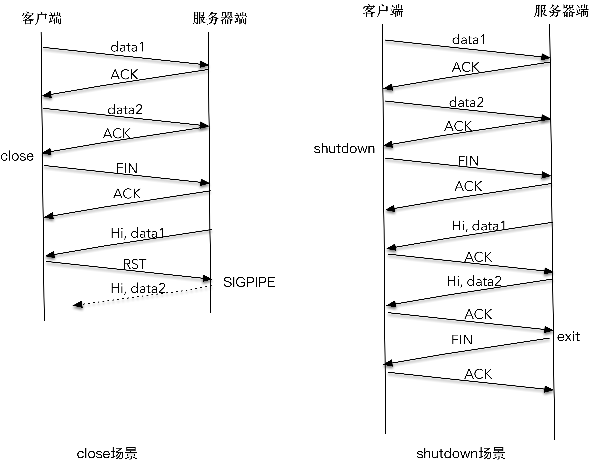

[TOC]

## 19 | 提高篇答疑：如何理解 TCP 四次挥手？

### 如何理解 TCP 四次挥手？

-   四次挥手过程
    -   

### 最大分组 MSL 是 TCP 分组在网络存活的最长时间吗？

-   MSL 是任何IP数据报能够在因特网中存活的最长时间。
-   RFC793 中规定 MSL 的时间为 2 分钟，Linux 实际设置为 30 秒。

### 关于 listen 函数中参数 backlog 的释义问题

-   原先 Linux 实现中，backlog 参数定义了该套接字对应的未完成连接队列的最大长度。
-   从 Linux 2.2 开始，backlog 的参数定义的是已完成连接队列的最大长度，表示的是已建立的连接，正在等待被接收，而不是原先的未完成队列的最大长度。

### UDP 连接和断开套接字的过程是怎样的？

-   UDP 连接套接字不是发起连接请求的过程，而是记录目的地址和端口到套接字映射关系。
-   断开套接字则相反，将删除原来记录的映射关系。

### 在 UDP 中不进行 connect，为什么客户端会收到信息？

-   服务器端程序，先通过 recvfrom 函数调用获取了客户端的地址和端口信息。然后，服务器端又通过调用 sendto 函数，把客户端地址和端口告诉内核协议栈。之后发送的 UDP 报文就带上了客户端的地址和端口信息，通过客户端的地址和端口信息，就可以挨到对应的套接字，就可以找到对应的套接字和应用程序，完成数据收发。

-   ```C
    
    //服务器端程序，先通过recvfrom函数调用获取了客户端的地址和端口信息
    int n = recvfrom(socket_fd, message, MAXLINE, 0, (struct sockaddr *) &client_addr, &client_len);
    message[n] = 0;
    printf("received %d bytes: %s\n", n, message);
    
    char send_line[MAXLINE];
    sprintf(send_line, "Hi, %s", message);
    
    //服务器端程序调用send函数，把客户端的地址和端口信息告诉了内核
    sendto(socket_fd, send_line, strlen(send_line), 0, (struct sockaddr *) &client_addr, client_len);
    ```

-   

### 我们是否可以对一个 UDP 套接字进行多次 connect 的操作？

-   对一个 UDP 套接字来说，进行多次 connect 操作是被允许的，这样主要有两个作用。
    1.  可以重新指定新的 IP 地址和端口号。
    2.  可以断开一个已连接的套接字。

### 第 11 讲中程序和时序图的解惑

-   
-   当一方主动 close 后，另一方发送数据的时候收到 RST。
    -   “Hi, data1” 这个是不应该被接收到的，这个数据即使发送出去也会收到 RST。
-   如果主动关闭一方调用 shutdown 关闭，没有关闭读这一端，主动关闭的一方可以读取对端的数据，注意这个时候主动关闭连接的一方是在使用read 方法进行读操作，而不是write 写操作，不会在 RST 的发生，更不会有 SIGPIPE 的发生。