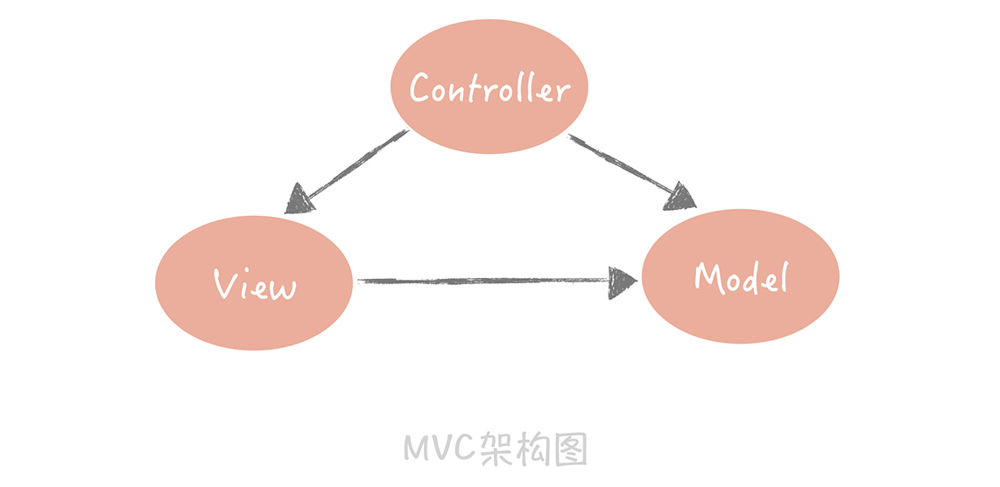

[toc] 

## 02 | 架构分层：为什么我们一定要这么做？

-   我们要如何对架构进行分层？架构分层和高并发架构又有什么关系呢？

### 什么是分层架构

-   软件架构分层在软件工程中是一咱常见的设计方式，它是将整体系统拆分成 N 个层次，每个层次有独立的职责，多个层次协同提供完整的功能。
-   如： MVC
    -   
-   如：OSI、TCP/IP 网络模型
    -   
-   Linux 文件系统分层设计
    -   

### 分层有什么好处

-   **分层的设计可以简化系统设计，让不同的人专注做某一层次的事情。**
-   **分层之后可以做到很高的复用。**
-   **分层架构可以让我们更容易做横向扩展。**
    -   横向扩展是高并发系统设计常用的方法之一，既然分层的架构可以为横向扩展提供便捷，那么，支撑高并发的系统一定是分层的系统。

### 如何来做系统分层

-   **最主要的一点是需要理解每个层次的边界是什么。**
-   此外，分层架构需要考虑层次间一定是**相邻层互相依赖**，数据的流转也只能在相邻的两层间流转。

### 分层架构的不足

-   最主要的一个缺陷就是**增加代码的复杂度**。
-   如果我们把每个层次独立部署，层次间通过网络来交互，那么多层的架构在性能上会有损耗。这也就是“**多一跳**”的问题。

-   最后，那我们是否要选择分层的架构呢？
    -   答案是肯定的。
    -   **我们在做决策的时候切不可以偏概全，因噎废食。**

### 课程小结

-   **分层架构是软件设计思想的外在体现，是一种实现方式。**我们熟知的一些软件设计原则都在分层架构中有所体现。